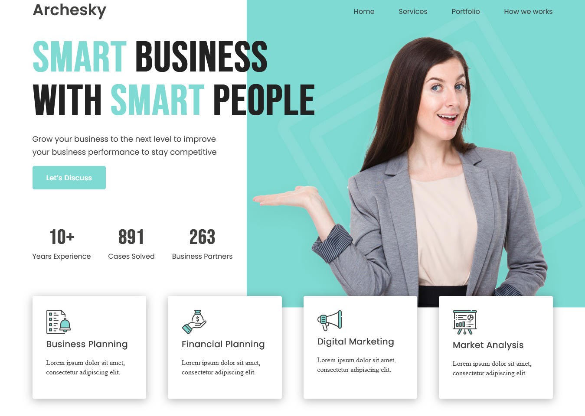

# Archesky Web Landing Page

Bienvenido a **Archesky**, una landing page moderna creada para practicar y mejorar habilidades en **CSS** y **HTML**. Este proyecto simula la página principal de una agencia de consultoría empresarial, destacando servicios clave y métricas de impacto.

## 🚀 Características

- Diseño limpio y profesional.
- Efectos visuales llamativos y paleta de colores atractiva.
- Secciones dedicadas a servicios: Planificación de negocios, planificación financiera, marketing digital y análisis de mercado.
- Métricas de experiencia y logros presentadas de forma clara.
- Botón de llamada a la acción para interacción del usuario.
- Menú de navegación.

## 🛠️ Tecnologías utilizadas

- **HTML5** para la estructura semántica.
- **CSS3** para el estilo moderno y responsivo.

## 📚 Propósito del proyecto

Este sitio web fue desarrollado para practicar diseño web y perfeccionar el dominio de **CSS** y **HTML**, enfocándose en la creación de interfaces atractivas y funcionales.

---

**¡Gracias por visitar este proyecto y espero que te inspire a seguir aprendiendo desarrollo web!**
